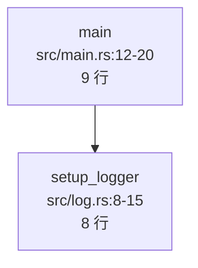

# CodeGraph 需求规范：从入口点构建调用图

> 日期：2026-09-17
> 项目：code-engine / CodeGraph
> 文档类型：需求规范（Requirements Specification）
> 目标：定义"从一个入口点出发，向下解析整个调用链，形成可查询、可展示的调用图，并给出每个函数的文件位置与行数等元数据"这一核心能力。

---

## 1. 背景与定位

### 1.1 一句话需求

> 给定一个入口点（如 `main`、某个 API handler、某个页面功能函数），自动解析它向下调用的所有函数，形成一棵调用树 / 调用图，并且每个函数都能给出：
>
> - 所在的文件路径
> - 起始行与结束行
> - 函数体行数
> - 签名、参数、返回类型
> - 调用它的位置（调用点行号）

### 1.2 这个能力解决什么问题

阅读一个陌生代码库时，最常见的三个问题是：

```text
1. "程序从哪里开始跑？"
2. "这个入口往下走了哪些逻辑？"
3. "这个函数在哪？多长？谁调用了它？"
```

传统做法是：

```text
打开编辑器 → 全局搜索函数名 → 一个个手动跳转 → 在脑子里拼调用链
```

本能力要把它变成：

```text
一条命令 → 输出完整调用树 + 每个函数的文件/行号/行数
```

### 1.3 定位边界

本能力属于 **CodeGraph 的查询层**，依赖 `scan` 已构建的 CodeGraph：

```text
scan  →  构建全项目 CodeGraph（nodes / edges / 元数据）
            ↓
callgraph  →  从入口点做可达性分析，输出子图 + 元数据
```

不在本规范范围内：

```text
❌ 代码修改
❌ 自动重构
❌ 跨语言混合调用解析（MVP1 仅 Rust）
❌ 运行时动态调用追踪（仅静态分析）
```

---

## 2. 核心用户场景

### 场景 A：理解程序主流程

```text
用户：我想知道这个项目启动后都做了什么。

命令：
  code-engine callgraph main

输出：
  main (src/main.rs:12-20, 9 行)
  ├── setup_logger (src/log.rs:8-15, 8 行)
  ├── load_config (src/config.rs:22-40, 19 行)
  └── run_server (src/server.rs:30-58, 29 行)
      ├── build_router (src/router.rs:10-35, 26 行)
      └── listen (src/server.rs:60-72, 13 行)
```

### 场景 B：定位某个功能的实现

```text
用户：登录功能是怎么实现的？涉及哪些函数？

命令：
  code-engine callgraph login --file src/auth.rs

输出：
  login (src/auth.rs:15-38, 24 行)
  ├── verify_password (src/auth.rs:40-55, 16 行)
  ├── create_token (src/token.rs:10-28, 19 行)
  └── save_session (src/session.rs:12-25, 14 行)
```

### 场景 C：反查调用来源

```text
用户：谁调用了 create_user？

命令：
  code-engine callers create_user

输出：
  create_user (src/user.rs:42-50, 9 行)
  ← 被以下函数调用：
    register_user (src/api.rs:88, line 91)
    admin_create_user (src/admin.rs:24, line 30)
```

### 场景 D：导出可视化

```text
用户：我要把调用关系画成图。

命令：
  code-engine callgraph main --format mermaid

输出：
  ```mermaid
  graph TD
      main --> setup_logger
      main --> load_config
      main --> run_server
      run_server --> build_router
      run_server --> listen
  ```
```

### 场景 E：分析调用规模

```text
用户：main 往下总共触及多少代码？

命令：
  code-engine callgraph main --stats

输出：
  可达函数:      47
  可达文件:      12
  总代码行数:  1,284
  最大深度:        6
  检测到循环:   2 处
```

---

## 3. 术语定义

| 术语 | 定义 |
| --- | --- |
| 入口点（Entry Point） | 调用图分析的起始函数，如 `main`、指定函数名、带注解的 handler |
| 调用图（Call Graph） | 以函数为节点、调用关系为边的有向图 |
| 调用树（Call Tree） | 调用图从某入口展开后的树形视图（遇到重复节点可标记已访问） |
| 可达性（Reachability） | 从入口点出发，沿调用边能到达的节点集合 |
| 调用点（Call Site） | 发生调用的具体代码位置，含文件与行号 |
| 递归调用（Recursion） | 函数直接或间接调用自身 |
| 未解析调用（Unresolved Call） | 静态分析无法确定目标的调用，如动态分发、宏展开 |

---

## 4. 功能需求

### 4.1 入口点识别（FR-1）

#### FR-1.1 显式指定入口

```bash
code-engine callgraph main
code-engine callgraph src/auth.rs::login
code-engine callgraph --file src/auth.rs login
```

要求：

- 支持按函数名查找入口；
- 同名函数存在多个时，全部列出并提示用户消歧义；
- 支持 `文件路径::函数名` 精确定位。

#### FR-1.2 自动发现入口点

```bash
code-engine callgraph --list-entries
```

Rust 项目应能自动识别：

```text
✅ fn main()
✅ #[tokio::main] / #[async_std::main] 等异步入口
✅ pub fn 且被外部 crate 引用的函数（启发式）
✅ #[tauri::command] 注解函数
✅ 测试函数（可选，--include-tests）
✅ lib.rs 中的 pub API
```

输出示例：

```text
Detected entry points:

  main                     src/main.rs:12
  handle_login             src/api.rs:45      #[tauri::command]
  handle_upload            src/api.rs:88      #[tauri::command]
  run                      src/lib.rs:20      pub
```

#### FR-1.3 入口点元数据

每个入口点必须能给出：

- 函数名与 qualified name
- 文件路径（相对项目根）
- 起始行、结束行、行数
- 是否异步、是否 unsafe、可见性

---

### 4.2 调用图构建（FR-2）

#### FR-2.1 向下递归解析

从入口点出发，沿 `Calls` 边递归向下，直到：

```text
✅ 到达叶子函数（无向下调用）
✅ 到达 std / 外部 crate 边界（标记 external）
✅ 到达配置的深度上限
✅ 遇到已访问节点（标记 cycle / reused）
```

#### FR-2.2 深度控制

```bash
code-engine callgraph main --depth 3
```

要求：

- 默认深度不限，但要防止无限展开；
- 达到上限的节点标记为 `truncated`，不静默省略；
- 输出中明确提示哪些分支被截断。

#### FR-2.3 循环与递归处理

```text
检测循环：A → B → C → A
处理方式：
  1. 不重复展开（标记为 cyclic）
  2. 输出中明确标记：<== cycle detected
  3. 不因循环导致死循环或爆栈
```

示例输出：

```text
  parse_expr (src/parser.rs:100-160, 61 行)
  ├── parse_term
  │   └── parse_factor
  │       └── parse_expr  <== cycle detected (already visited)
```

#### FR-2.4 外部依赖边界

```text
遇到以下情况标记为 external，不继续展开：
  ✅ std::* 标准库调用
  ✅ 外部 crate 调用（非本 workspace）
  ✅ 系统调用 / FFI
```

示例：

```text
  read_file (src/io.rs:10-20, 11 行)
  └── std::fs::read_to_string   [external]
```

#### FR-2.5 过滤能力

```bash
code-engine callgraph main --exclude-tests
code-engine callgraph main --exclude "src/generated/**"
code-engine callgraph main --only-paths "src/**"
```

---

### 4.3 节点元数据（FR-3）

这是本需求的重点：**每个函数都必须能回答"它在哪、多长、长什么样"**。

#### FR-3.1 必须提供的元数据

| 字段 | 说明 | 示例 |
| --- | --- | --- |
| `name` | 函数名 | `create_user` |
| `qualified_name` | 完整路径名 | `crate::user::create_user` |
| `file` | 相对项目根的文件路径 | `src/user/service.rs` |
| `start_line` | 函数起始行 | `42` |
| `end_line` | 函数结束行 | `50` |
| `line_count` | 函数体行数 | `9` |
| `kind` | 函数 / 方法 / 关联函数 | `Function` |
| `visibility` | 可见性 | `pub` / `pub(crate)` / `private` |
| `is_async` | 是否 async | `false` |
| `is_unsafe` | 是否 unsafe | `false` |
| `signature` | 完整签名 | `pub fn create_user(id: u64) -> User` |
| `params` | 参数列表 | `id: u64` |
| `return_type` | 返回类型 | `User` |
| `doc_comment` | 文档注释（可选） | `/// 创建用户` |

#### FR-3.2 行数统计规则

必须明确定义，避免歧义：

```text
start_line     = fn 关键字所在行
end_line       = 函数闭合大括号 } 所在行
line_count     = end_line - start_line + 1        （含签名与括号）
body_line_count = 函数体内实际语句行数            （不含空行与注释，可选字段）
```

示例：

```rust
42 | pub fn create_user(id: u64) -> User {      <- start_line = 42
43 |     let user = User::new(id);
44 |     save(&user);
45 |     user
46 | }                                            <- end_line = 46
```

```text
line_count      = 5   (42-46)
body_line_count = 3   (43-45)
```

#### FR-3.3 方法归属

```text
impl User {
    pub fn new(...) -> Self { ... }        → qualified_name = crate::user::User::new
}
```

要求：

- 方法必须带所属类型；
- `impl Trait for Type` 中的方法标记 `trait_impl`；
- 关联函数与实例方法要可区分（是否有 `self` 参数）。

#### FR-3.4 调用点信息

每条调用边必须能给出调用发生的位置：

| 字段 | 说明 |
| --- | --- |
| `call_site_file` | 调用所在文件 |
| `call_site_line` | 调用所在行号 |
| `call_site_column` | 列号（可选） |
| `is_resolved` | 是否成功解析到目标 |
| `resolution_kind` | `local` / `module_path` / `method` / `unresolved` |

---

### 4.4 展示需求（FR-4）

#### FR-4.1 树形文本输出（默认）

```bash
code-engine callgraph main
```

要求：

- 缩进表示层级；
- 每行包含：函数名 + 文件:行范围 + 行数；
- 使用 `├──` / `└──` 树形符号；
- 循环、截断、外部节点有明确标记。

示例：

```text
main (src/main.rs:12-20, 9 行)
├── setup_logger (src/log.rs:8-15, 8 行)
├── load_config (src/config.rs:22-40, 19 行)
│   └── parse_toml (src/config.rs:42-60, 19 行)
│       └── toml::from_str   [external]
└── run_server (src/server.rs:30-58, 29 行)
    ├── build_router (src/router.rs:10-35, 26 行)
    │   └── register_routes (src/router.rs:37-80, 44 行)
    └── listen (src/server.rs:60-72, 13 行)
        └── handle_connection (src/server.rs:74-120, 47 行)
            └── parse_expr (src/parser.rs:100-160, 61 行)
                └── parse_term
                    └── parse_factor
                        └── parse_expr  <== cycle detected
```

#### FR-4.2 详细模式

```bash
code-engine callgraph main --verbose
```

额外展示：

```text
main (src/main.rs:12-20, 9 行)
│  signature: fn main()
│  visibility: private
│  async: false
│  calls: 3
│  called_by: 0
├── setup_logger (src/log.rs:8-15, 8 行)
│  signature: fn setup_logger()
...
```

#### FR-4.3 Mermaid 输出

```bash
code-engine callgraph main --format mermaid
```



要求：

- 节点标签包含函数名、文件、行范围；
- 支持标注循环边（虚线）；
- 支持 `--no-meta` 只输出函数名（图太大时）。

#### FR-4.4 JSON 输出

```bash
code-engine callgraph main --format json
```

必须输出版本化、可被其他工具消费的结构，见第 6 节数据模型。

#### FR-4.5 统计摘要

```bash
code-engine callgraph main --stats
```

输出：

```text
Call Graph Statistics
─────────────────────
Entry point:        main
Reachable funcs:    47
Reachable files:    12
Total lines:        1,284
Max depth:          6
Cycles detected:    2
Unresolved calls:   9
External calls:     23
```

---

### 4.5 反向查询需求（FR-5）

```bash
code-engine callers create_user
```

要求：

- 输出谁调用了目标函数；
- 显示调用点行号；
- 支持递归向上（`--depth`）；
- 支持输出调用链而非单层：

```text
create_user (src/user.rs:42-46, 5 行)
← 被调用方（向上追溯）:

  register_user (src/api.rs:88-95, 8 行)
    调用点: src/api.rs:91
    ← handle_register (src/api.rs:60-80, 21 行)
        调用点: src/api.rs:72

  admin_create_user (src/admin.rs:24-35, 12 行)
    调用点: src/admin.rs:30
```

---

### 4.6 函数信息查询需求（FR-6）

即使不做调用图，也要能单独查函数信息：

```bash
code-engine info create_user
```

输出：

```text
create_user
────────────────────────────────────
文件:       src/user/service.rs
起始行:     42
结束行:     46
行数:       5
签名:       pub fn create_user(id: u64) -> User
可见性:     pub
async:      false
所属模块:   crate::user
调用方:     register_user, admin_create_user
被调用:     User::new, save
```

---

## 5. CLI 接口规范

### 5.1 命令总览

```text
code-engine callgraph <entry> [options]    从入口点构建调用图
code-engine callers <symbol> [options]     反查谁调用了它
code-engine info <symbol> [options]        查看单个符号信息
```

### 5.2 `callgraph` 参数

| 参数 | 类型 | 默认值 | 说明 |
| --- | --- | --- | --- |
| `<entry>` | string | - | 入口函数名或 `文件::函数` |
| `--depth <n>` | number | 不限 | 最大展开深度 |
| `--format <fmt>` | enum | `text` | `text` / `mermaid` / `json` / `dot` |
| `--verbose` | flag | false | 展示签名等详细信息 |
| `--stats` | flag | false | 输出统计摘要 |
| `--exclude-tests` | flag | false | 排除测试函数 |
| `--exclude <glob>` | repeatable | - | 排除路径 |
| `--only-paths <glob>` | repeatable | - | 只包含路径 |
| `--show-unresolved` | flag | true | 是否展示未解析调用 |
| `--include-external` | flag | false | 是否展开外部调用 |
| `--max-nodes <n>` | number | 500 | 防止输出爆炸 |

### 5.3 `callers` 参数

| 参数 | 类型 | 默认值 | 说明 |
| --- | --- | --- | --- |
| `<symbol>` | string | - | 目标函数 |
| `--depth <n>` | number | 1 | 向上追溯层数 |
| `--format <fmt>` | enum | `text` | `text` / `json` |

### 5.4 `info` 参数

| 参数 | 类型 | 默认值 | 说明 |
| --- | --- | --- | --- |
| `<symbol>` | string | - | 符号名 |
| `--format <fmt>` | enum | `text` | `text` / `json` |

### 5.5 退出码约定

```text
0   成功
1   通用错误
2   入口点未找到
3   未找到 CodeGraph（需要先 scan）
4   参数错误
```

### 5.6 错误提示规范

```bash
$ code-engine callgraph main
No CodeGraph found.
Run first:

  code-engine scan .
```

```bash
$ code-engine callgraph not_exist
Entry point "not_exist" not found.

Did you mean:
  create_user  (src/user/service.rs:42)
  create_order (src/order.rs:18)

Or list all entry points:
  code-engine callgraph --list-entries
```

---

## 6. 数据模型

### 6.1 调用图输出结构

```json
{
  "schema_version": 1,
  "entry_point": {
    "name": "main",
    "qualified_name": "crate::main",
    "file": "src/main.rs",
    "start_line": 12,
    "end_line": 20,
    "line_count": 9
  },
  "nodes": [
    {
      "id": "function:crate::main@src/main.rs:12",
      "name": "main",
      "qualified_name": "crate::main",
      "kind": "Function",
      "file": "src/main.rs",
      "start_line": 12,
      "end_line": 20,
      "line_count": 9,
      "signature": "fn main()",
      "visibility": "private",
      "is_async": false,
      "is_unsafe": false,
      "depth": 0,
      "truncated": false,
      "cyclic": false,
      "external": false
    }
  ],
  "edges": [
    {
      "from": "function:crate::main@src/main.rs:12",
      "to": "function:crate::setup_logger@src/log.rs:8",
      "kind": "Calls",
      "call_site_file": "src/main.rs",
      "call_site_line": 14,
      "is_resolved": true,
      "resolution_kind": "local"
    }
  ],
  "stats": {
    "reachable_functions": 47,
    "reachable_files": 12,
    "total_lines": 1284,
    "max_depth": 6,
    "cycles": 2,
    "unresolved_calls": 9,
    "external_calls": 23
  },
  "warnings": [
    {
      "kind": "UnresolvedCall",
      "message": "cannot resolve receiver type for client.send()",
      "file": "src/http.rs",
      "line": 88
    }
  ]
}
```

### 6.2 元数据完整性要求

```text
✅ 每个 node 必须有 file / start_line / end_line / line_count
✅ 每条 edge 必须有 call_site_file / call_site_line
✅ 无法解析的调用必须在 warnings 中显式记录
✅ 不允许用 0 或 null 伪装"已解析"
```

---

## 7. 解析范围与降级策略

### 7.1 MVP1 必须正确解析

```text
✅ 同文件内函数调用        foo()
✅ 同模块内函数调用        foo()  （同一 mod）
✅ 模块路径调用            user::create_user()
✅ 绝对路径调用            crate::user::create_user()
✅ 相对路径调用            self::foo() / super::foo()
✅ 类型关联函数            User::new()
✅ 实例方法调用            user.save()
✅ use 导入后的别名调用    use x as y; y::foo()
✅ 泛型函数的直接调用      process::<T>(x)
```

### 7.2 MVP1 允许降级为 unresolved

```text
⚠️ 通过 trait 对象动态分发    dyn Trait → 可能有多个实现
⚠️ 函数指针 / 闭包            let f = foo; f()
⚠️ 宏展开产生的调用           println! / vec! / 自定义宏
⚠️ 条件编译分支               #[cfg(...)]
⚠️ 跨 crate 调用非 workspace 部分
⚠️ 泛型单态化后的具体目标
```

降级要求：

```text
✅ 必须记录为 UnresolvedCall 警告
✅ 必须在输出中可见（默认显示，可用 --no-show-unresolved 隐藏）
✅ 绝不伪装成"已解析"
✅ 绝不因为 unresolved 导致整个命令失败
```

### 7.3 正确性优先级

```text
第一优先：不崩溃、不卡死、不给出错误结论
第二优先：元数据准确（文件、行号、行数）
第三优先：调用边尽量完整
第四优先：复杂语义（trait / 宏 / 泛型）尽力而为
```

---

## 8. 非功能需求

### 8.1 性能

| 指标 | 要求 |
| --- | --- |
| 中等项目（1k 函数）调用图构建 | < 2 秒（基于已 scan 的图） |
| 大型项目（10k 函数） | < 10 秒 |
| 输出 node 上限 | 默认 500，可配 `--max-nodes` |
| 内存增长 | 与可达节点数线性相关，不得全量加载源码 |

关键要求：

```text
callgraph 命令不应重新解析源码；
它必须查询 scan 已构建的 CodeGraph。
```

### 8.2 正确性

```text
✅ 行号必须与真实源码一致（1-based）
✅ 行数计算规则必须文档化且测试覆盖
✅ 循环检测必须有效，不得死循环
✅ 同名函数必须能区分（qualified name）
```

### 8.3 稳定性

```text
✅ 源码语法错误时不崩溃，标记该文件为 parse_error
✅ 无 CodeGraph 时给出明确指引
✅ 大图输出时提示可能截断
```

### 8.4 可用性

```text
✅ 默认输出人类可读
✅ 错误信息给出下一步建议
✅ 未找到入口时提供相似名称建议
```

---

## 9. 验收标准

### 9.1 功能验收

```text
□ code-engine callgraph main 能输出完整调用树
□ 每个节点包含 文件 / 起始行 / 结束行 / 行数
□ 叶子函数正确停止展开
□ std / 外部调用标记为 external
□ 循环调用标记为 cycle detected 且不死循环
□ --depth 生效且截断处有标记
□ --format mermaid 输出合法 Mermaid
□ --format json 输出符合第 6 节 schema
□ --stats 输出统计正确
□ code-engine callers <fn> 能反查调用方及调用点行号
□ code-engine info <fn> 能输出单函数完整信息
□ --list-entries 能列出检测到的入口点
□ 未找到入口时给出相似建议
□ 无 CodeGraph 时提示先执行 scan
```

### 9.2 元数据准确性验收

用固定 fixture 项目验证：

```text
fixture: tests/fixtures/callgraph-basic/

□ main 的 start_line / end_line 与源码一致
□ line_count 计算正确（含签名与括号）
□ 每个调用边的 call_site_line 与源码一致
□ impl 方法的 qualified_name 含类型名
□ pub / private 可见性判断正确
```

### 9.3 边界验收

```text
□ 递归函数不死循环
□ 相互递归（A→B→A）正确标记
□ 空函数体正确输出 line_count = 1 或 2
□ 超长函数正确计算行数
□ 同名函数（不同模块）正确区分
□ 不存在的外部调用不报错
□ 语法错误文件不导致整体失败
```

---

## 10. 分期实现建议

### 阶段 1：最小可用调用树

```text
1. callgraph <entry> 基本命令
2. 从入口递归向下遍历 Calls 边
3. 节点展示 函数名 + 文件 + 行范围 + 行数
4. 循环检测
5. 文本树形输出
```

### 阶段 2：元数据完善

```text
6. 完整 signature / visibility / is_async
7. 调用点行号
8. --verbose 详细模式
9. info 命令
```

### 阶段 3：反查与统计

```text
10. callers 命令
11. --stats 统计摘要
12. --depth / --max-nodes 控制
```

### 阶段 4：可视化输出

```text
13. --format mermaid
14. --format json
15. --format dot（可选）
```

### 阶段 5：入口点发现与过滤

```text
16. --list-entries
17. 自动识别 #[tauri::command] 等注解
18. --exclude / --only-paths / --exclude-tests
```

---

## 11. 风险与取舍

| 风险 | 影响 | 应对 |
| --- | --- | --- |
| 动态分发无法解析 | 调用图不完整 | 显式标记 unresolved，不猜测 |
| 宏产生大量代码 | 漏掉真实调用 | MVP1 保守，标记 unsupported |
| 大项目输出爆炸 | 难以阅读 | `--depth` / `--max-nodes` / `--format json` |
| 行数定义歧义 | 结果不可信 | 文档化规则 + 测试覆盖 |
| 同名函数冲突 | 指错目标 | qualified_name 区分 + 消歧义提示 |
| receiver 类型未知 | 方法调用解析失败 | 标记 unresolved，不伪装 |

---

## 12. 结论

本规范定义的核心能力是：

```text
入口点  →  向下可达调用图  →  带完整元数据的函数节点
```

三个必须守住的底线：

```text
1. 每条调用边都要能回答"在哪调的"（文件 + 行号）
2. 每个函数节点都要能回答"它在哪、多长"（文件 + 行范围 + 行数）
3. 解析不了的东西必须显式说不确定，绝不伪装成已解析
```

一句话总结：

> 让用户用一条命令，从程序入口（或任意功能函数）出发，看清它下面所有的调用关系，
> 并且随时能知道每一个函数写在哪个文件的第几行、一共多少行。
