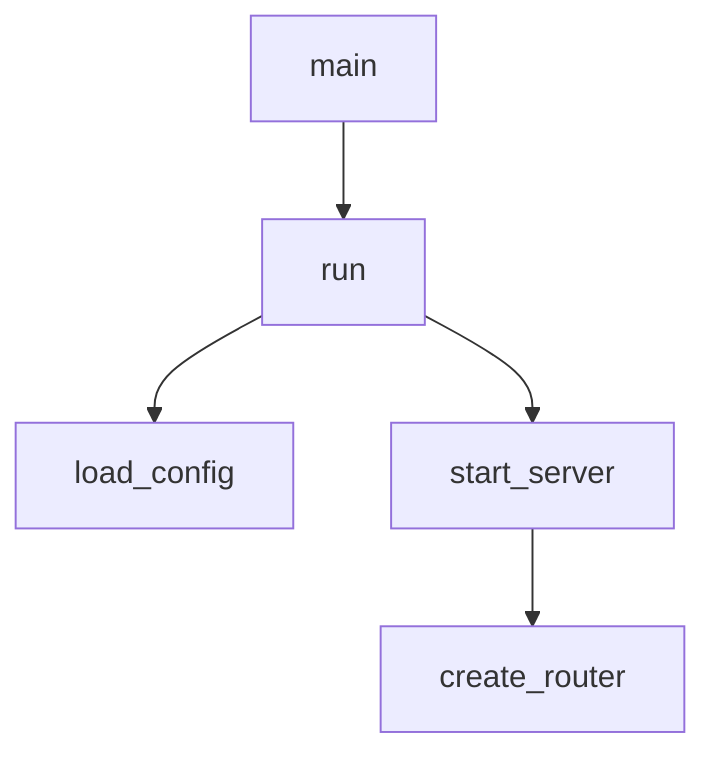

# CodeGraph / code-engine MVP 阶段功能拆分

> 日期：2026-09-05
> 来源：用户提供的 ChatGPT share 链接与当前讨论整理
> 产品定位：Code Intelligence Engine / 代码理解引擎
> 核心目标：把源码转换成语言无关的 CodeGraph，再基于 Graph 提供项目结构、符号关系、调用关系、依赖关系、流程分析、可视化和 AI Context。

---

## 0. 总体定位

这个项目第一阶段不要做成“代码变更分析工具”，也不要一开始做 Git rename detection、增量索引、复杂历史追踪。

更清晰的产品边界是：

```text
Source Code
  ↓
Scanner / Parser
  ↓
Semantic IR
  ↓
Resolver
  ↓
CodeGraph
  ↓
Queries / Visualization / AI Context
```

一句话：

> CodeGraph 负责“代码是什么、它们之间有什么关系”；Change Detection 负责“代码相比上一次发生了什么”。前者是核心语义能力，后者是后期性能优化能力。

---

## 1. 阶段总览

| 阶段 | 目标 | 核心价值 | 重点能力 | 不做什么 |
| --- | --- | --- | --- | --- |
| MVP 0 | 工程骨架 / CLI 骨架 | 能跑起来 | CLI 框架、项目结构、测试框架 | 不做真实语义分析 |
| MVP 1 | Rust CodeGraph 最小闭环 | 证明“能把代码变成 Graph” | Rust 扫描、解析、基础符号、基础调用图、Mermaid | 不做多语言、不做增量、不做复杂类型推导 |
| MVP 2 | 语义增强 + 多视角理解 | 证明“Graph 真能帮助人和 AI 理解代码” | Control Flow、Dependency Graph、Type Graph、TypeScript、AI Context、MCP | 不做大型项目极限优化 |
| MVP 3 | 大型项目工程化 | 让系统在真实大型仓库里又快又准 | 增量索引、Git rename、Symbol lineage、持久化数据库、性能优化 | 不改变核心模型方向 |

---

## 2. MVP 0：工程骨架

### 2.1 目标

先把项目结构、CLI 入口、测试框架搭起来，确保后面的功能有稳定落点。

### 2.2 需要实现的功能

| 功能 | 说明 |
| --- | --- |
| CLI 入口 | `code-engine` 命令可运行 |
| 基础 help | `code-engine --help` 输出命令列表 |
| 项目结构 | 分清 scanner / parser / graph / query / renderer 模块 |
| 错误处理 | 文件不存在、路径不是目录、有权限问题时返回明确错误 |
| 测试框架 | 能写单元测试和 fixture 测试 |
| 示例 fixture | 准备一个小型 Rust 项目作为测试输入 |

### 2.3 验收标准

```text
code-engine --help 能正常输出
code-engine scan ./not-exists 能给出明确错误
cargo test 通过
项目模块边界清晰，不把全部逻辑塞进 main.rs
```

### 2.4 不包含

```text
❌ 真实 CodeGraph
❌ 调用图
❌ Mermaid 输出
❌ 多语言
❌ 数据库
```

---

## 3. MVP 1：Rust CodeGraph 最小闭环

### 3.1 阶段目标

> 给一个 Rust 项目，能够建立一个基本可查询的 CodeGraph，并生成项目结构和调用关系。

MVP1 的核心不是“功能很多”，而是打通：

```text
Rust source
  ↓
AST
  ↓
Symbol
  ↓
Resolve
  ↓
CodeGraph
  ↓
Tree / Symbols / CallGraph / Mermaid
```

---

### 3.2 MVP1 内部模块

这些是内部实现模块，不应该全部变成 CLI 命令。

| 模块 | 职责 | 是否直接暴露为命令 |
| --- | --- | --- |
| Scanner | 遍历目录，找源码文件，过滤无关目录 | 否，归入 `scan` |
| Parser | 用 `syn` 解析 Rust AST | 否，归入 `scan` |
| Symbol Builder | 从 AST 提取模块、函数、结构体、trait 等符号 | 否，归入 `scan` |
| Resolver | 解析调用关系、引用关系、模块路径 | 否，归入 `scan` |
| Graph Builder | 构建 Nodes + Edges | 否，归入 `scan` |
| Query | 查询 tree / symbols / calls 等 | 是，通过查询命令暴露 |
| Renderer | 输出文本 / Mermaid / JSON | 否，作为 `graph --format` 的格式选项 |

---

### 3.3 MVP1 数据模型

第一版保持极简：

```rust
pub struct CodeGraph {
    pub nodes: Vec<Node>,
    pub edges: Vec<Edge>,
}

pub struct Node {
    pub id: NodeId,
    pub kind: NodeKind,
    pub name: String,
    pub location: SourceLocation,
}

pub struct Edge {
    pub source: NodeId,
    pub target: NodeId,
    pub kind: EdgeKind,
}

pub enum NodeKind {
    File,
    Module,
    Struct,
    Enum,
    Trait,
    Function,
    Method,
    Variable,
    Field,
}

pub enum EdgeKind {
    Contains,
    Calls,
    References,
    Imports,
    Implements,
    Extends,
    UsesType,
}
```

### 3.4 SymbolId

MVP1 需要 SymbolId，但职责要简单：

> SymbolId 用来标识一个语义实体，不是用来记录 rename / move / split / merge 历史。

第一版可由以下信息生成：

```text
crate/package + module_path + symbol_name + kind
```

暂时不做：

```text
❌ Git rename detection
❌ Symbol lineage
❌ Split / merge detection
❌ 复杂 fingerprint
```

---

### 3.5 MVP1 CLI 命令

MVP1 最终建议只做 6 个核心命令：

```text
code-engine
├── scan        扫描并分析项目，建立 CodeGraph
├── tree        查看项目/代码结构
├── symbols     查找符号
├── calls       查看调用关系
├── graph       输出可视化图
└── stats       查看代码统计
```

关键原则：

```text
scan 是写入 / 构建：Source → Parser → Resolver → CodeGraph
其他命令是读取 / 查询：CodeGraph → Query → Output
```

不要写成：

```text
scan command   -> 自己解析代码
tree command   -> 自己解析代码
calls command  -> 自己解析代码
```

应该是：

```text
scan 构建一次 CodeGraph
其他命令全部查询已经构建好的 CodeGraph
```

---

### 3.6 命令 1：scan

#### 用途

建立 CodeGraph。

#### 命令

```bash
code-engine scan ./my-project
# 或
code-engine scan .
```

#### 内部流程

```text
scan
 ├── Scanner
 ├── Parser
 ├── Symbol Builder
 ├── Resolver
 └── Graph Builder
        ↓
    CodeGraph
```

#### 最小输出

```text
Scanning project...

Files:       128
Modules:      24
Structs:      87
Functions:   412
Methods:     263
Calls:      1850
Imports:     326

Graph built successfully.
```

#### MVP1 先不做的参数

```bash
code-engine scan ./project --lang rust
code-engine scan ./project --format json
code-engine scan --watch
```

---

### 3.7 命令 2：tree

#### 用途

查看项目结构 / 代码结构。

#### 命令

```bash
code-engine tree
```

#### 示例输出

```text
my-project
├── src
│   ├── main.rs
│   │   └── main
│   ├── user
│   │   ├── mod.rs
│   │   ├── model.rs
│   │   │   └── User
│   │   └── service.rs
│   │       └── UserService
│   │           ├── new
│   │           └── create
│   └── auth.rs
│       ├── login
│       └── logout
└── Cargo.toml
```

#### 查询关系

```text
Contains
Defines
```

---

### 3.8 命令 3：symbols

#### 用途

查询项目里的符号。

#### 命令

```bash
code-engine symbols User
```

#### 示例输出

```text
User

Type:
    struct

Location:
    src/user/model.rs:12

Fields:
    id: u64
    name: String

Used by:
    UserService::create
    UserRepository::save
```

#### MVP1 范围

```bash
code-engine symbols <name>
```

以后再考虑：

```bash
code-engine symbols
code-engine symbols --kind function
code-engine symbols UserService
```

---

### 3.9 命令 4：calls

#### 用途

查看调用关系，是 MVP1 的核心功能之一。

#### 命令

```bash
code-engine calls main
```

#### 示例输出

```text
main
└── run
    ├── load_config
    └── start_server
        ├── create_router
        └── start
```

#### 调用者查询

MVP1 建议先统一在 `calls` 命令里做方向参数：

```bash
code-engine calls create_user --direction callers
```

而不是一开始拆成：

```text
calls
callers
callees
```

---

### 3.10 命令 5：graph

#### 用途

输出真正的可视化图。`calls` 是给人看的树状结构，`graph` 是给可视化工具 / Markdown / AI 的图结构。

#### 命令

```bash
code-engine graph main
code-engine graph main --format mermaid
```

#### Mermaid 输出示例



#### 设计原则

Renderer 是输出格式，不应该各自成为 CLI command。

```text
graph
 ├── mermaid
 ├── plantuml   # MVP2 或以后
 ├── json       # MVP2 或以后
 └── dot        # MVP2 或以后
```

MVP1 默认先做 Mermaid。

---

### 3.11 命令 6：stats

#### 用途

查看代码统计。

#### 命令

```bash
code-engine stats
```

#### 示例输出

```text
Project Statistics

Files:          128
Lines:        42,381

Modules:         24
Structs:         87
Enums:           21
Traits:          34
Functions:      412
Methods:        263

Calls:        1,850
References:   4,231
Imports:        326
```

---

### 3.12 MVP1 不做

```text
❌ 多语言
❌ TypeScript
❌ Control Flow Graph
❌ Type Graph
❌ Dependency Graph 深度分析
❌ MCP
❌ AI Context
❌ 持久化数据库
❌ 增量索引
❌ Git rename detection
❌ Symbol lineage
❌ watch 模式
❌ report 命令
```

### 3.13 MVP1 验收标准

```text
给定一个小型 Rust 项目：

□ code-engine scan . 能扫描 Rust 文件并构建 CodeGraph
□ 能识别 module / struct / enum / trait / function / method / impl / use
□ 能生成 Contains / Calls / Imports 等基础边
□ code-engine tree 能输出项目结构
□ code-engine symbols <name> 能定位符号
□ code-engine calls <function> 能输出基本调用树
□ code-engine graph <function> --format mermaid 能输出 Mermaid
□ code-engine stats 能输出基础统计
□ 复杂宏 / 复杂泛型 / 动态 dispatch 可以降级为 unresolved，但不能崩溃
□ 所有命令基于同一个 CodeGraph 查询，不重复解析整套代码
```

---

## 4. MVP 2：语义增强 + 多视角理解

### 4.1 阶段目标

> 从“能看代码结构”升级到“真正帮助人和 AI 理解代码”。

MVP2 不应该继续堆很多零散 Node / Edge，而应该转向：

```text
语义质量 + 多语言 + 流程分析 + AI Context + MCP
```

---

### 4.2 MVP2.1 Control Flow / 流程图

#### 目标

分析一个函数内部的控制流，而不仅仅是它调用了哪些函数。

调用图只能表达：

```text
login
├── verify_password
├── create_token
└── save_session
```

流程图要表达：

```text
login
  ↓
verify_password
  ↓
false ─→ Error
true  ─→ create_token ─→ save_session ─→ Ok
```

#### 需要实现

| 功能 | 说明 |
| --- | --- |
| if / match / return 分析 | 建立基本控制流节点 |
| 函数内执行顺序 | 表达语句之间先后关系 |
| 分支条件 | 表达 true / false 或 match arm |
| Mermaid flowchart 输出 | 用 Markdown 可读形式展示 |

---

### 4.3 MVP2.2 Dependency Graph

#### 目标

回答：

```text
这个模块依赖了什么？
谁依赖这个模块？
```

#### 需要实现

| 功能 | 说明 |
| --- | --- |
| module dependency | 模块间依赖 |
| import/use graph | `use` 关系 |
| reverse dependency | 谁依赖我 |
| dependency graph 输出 | Mermaid / JSON |

#### 示例命令

```bash
code-engine graph user_service --type dependency
code-engine deps user_service
```

> 命令是否单独拆 `deps` 可以到 MVP2 再决定，MVP1 暂不做。

---

### 4.4 MVP2.3 Type Graph

#### 目标

分析类型关系：

```text
Struct 有哪些字段？
Trait 被谁实现？
函数参数和返回值用到了哪些类型？
```

#### 需要实现

| 功能 | 说明 |
| --- | --- |
| Struct / Enum 字段关系 | `User -> Field -> String/u64` |
| Trait / Impl 关系 | `UserService implements Service` |
| Function signature 类型 | 参数和返回值类型 |
| UsesType 边 | 类型引用关系 |

---

### 4.5 MVP2.4 第二语言：TypeScript

#### 目标

验证 CodeGraph 是否真正语言无关。

如果模型设计正确，Rust 和 TypeScript 都应该进入同一套：

```rust
CodeGraph {
    nodes,
    edges,
}
```

#### 需要实现

| 功能 | 说明 |
| --- | --- |
| TypeScript Scanner | 识别 `.ts` / `.tsx` |
| TS Parser | 可用 swc / tree-sitter / TypeScript compiler API |
| TS Symbol Builder | function / class / interface / type / import |
| TS Calls / Imports | 基础调用和导入关系 |
| 与 Rust 共用 Graph Query | tree / symbols / calls / graph 复用 |

---

### 4.6 MVP2.5 AI Context

#### 目标

不要直接把文件塞给 AI，而是先用 Graph 找到相关上下文。

用户问：

```text
create_order 是怎么创建订单的？
```

系统应该：

```text
1. 查询 create_order 符号
2. 找到它调用了谁
3. 找到谁调用它
4. 找到相关类型和模块
5. 生成一个结构化上下文包给 AI
```

#### 需要实现

| 功能 | 说明 |
| --- | --- |
| graph-based context selection | 根据符号和边选择上下文 |
| context package | 输出给 AI 的结构化包 |
| source snippets | 相关源码片段 |
| graph summary | 调用关系/类型关系摘要 |
| token budget | 控制上下文大小 |

---

### 4.7 MVP2.6 MCP

#### 目标

让 Claude / Codex / 其他 Agent 可以通过 MCP 直接问代码库。

#### 需要实现

| MCP Tool | 说明 |
| --- | --- |
| `scan_project` | 扫描并建立 CodeGraph |
| `find_symbol` | 查符号 |
| `get_callgraph` | 获取调用图 |
| `get_dependencies` | 获取依赖关系 |
| `get_ai_context` | 生成 AI 上下文包 |

---

### 4.8 MVP2 验收标准

```text
□ 能为一个函数生成基本流程图
□ 能查询模块依赖和反向依赖
□ 能查询类型关系和 trait/impl 关系
□ 能扫描一个 TypeScript 小项目并进入同一套 CodeGraph
□ Rust 和 TypeScript 查询命令保持一致
□ 能根据符号生成 AI Context，而不是简单塞整文件
□ MCP 工具可被外部 Agent 调用
□ MVP1 的 scan/tree/symbols/calls/graph/stats 不被破坏
```

---

## 5. MVP 3：大型项目工程化

### 5.1 阶段目标

> 让 CodeGraph 在真实大型代码库里又快又准。

MVP3 做的是工程化、性能、持久化和历史能力，不是重新定义产品核心。

---

### 5.2 需要实现的功能

| 功能 | 说明 |
| --- | --- |
| Incremental Index | 只重新分析变化文件 |
| Change Detector | 识别 added / modified / deleted |
| Git rename detection | 识别文件移动 / 重命名 |
| Symbol lineage | 跟踪符号改名 / 移动历史 |
| 持久化数据库 | SQLite / RocksDB / sled 等持久保存 Graph |
| Graph Delta | 增量更新 nodes / edges |
| 大项目优化 | 并行扫描、缓存、内存控制 |
| watch 模式 | 文件变化自动更新 Graph |
| 更强 Resolver | 复杂泛型、宏、trait、动态分发增强 |
| 多输出格式 | PlantUML / DOT / JSON 完善 |

---

### 5.3 MVP3 不应该提前做的原因

这些能力都很有价值，但它们回答的是：

```text
如何让系统更快、更稳定、更适合大型项目？
```

而不是：

```text
CodeGraph 这个产品有没有价值？
```

所以它们必须放在 MVP1/MVP2 之后。

---

### 5.4 MVP3 验收标准

```text
□ 大型项目第二次扫描明显快于第一次
□ 修改少量文件时只更新相关 nodes / edges
□ 文件 rename 后尽量保留符号身份
□ 数据库重启后可以恢复 Graph
□ watch 模式不会频繁重复全量扫描
□ 大项目不会 OOM
□ 复杂项目中 unresolved 节点有明确标记，不伪装成已解析
```

---

## 6. 最终功能矩阵

| 能力 | MVP0 | MVP1 | MVP2 | MVP3 |
| --- | --- | --- | --- | --- |
| CLI 骨架 | ✅ | ✅ | ✅ | ✅ |
| 文件扫描 |  | ✅ | ✅ | ✅ 增量 |
| Rust Parser |  | ✅ | ✅ 增强 | ✅ 增强 |
| Symbol Model |  | ✅ | ✅ | ✅ |
| SymbolId |  | ✅ 基础 | ✅ | ✅ lineage |
| Name Resolution |  | ✅ 基础 | ✅ 增强 | ✅ 高级 |
| CodeGraph |  | ✅ | ✅ | ✅ 持久化 |
| Project Tree |  | ✅ | ✅ | ✅ |
| Symbol 查询 |  | ✅ | ✅ | ✅ |
| Call Graph |  | ✅ | ✅ | ✅ |
| Caller / Callee |  | ✅ | ✅ | ✅ |
| Import Graph |  | ✅ 基础 | ✅ | ✅ |
| Dependency Graph |  |  | ✅ | ✅ |
| Type Graph |  |  | ✅ | ✅ 增强 |
| Control Flow |  |  | ✅ | ✅ 增强 |
| TypeScript |  |  | ✅ | ✅ |
| AI Context |  |  | ✅ | ✅ |
| MCP |  |  | ✅ | ✅ |
| Mermaid |  | ✅ | ✅ | ✅ |
| PlantUML / DOT |  |  | ✅ 可选 | ✅ |
| Incremental Index |  |  |  | ✅ |
| Git Rename |  |  |  | ✅ |
| Symbol Lineage |  |  |  | ✅ |
| 持久化数据库 |  |  | 可选 | ✅ |
| 超大型项目优化 |  |  |  | ✅ |

---

## 7. 推荐实施顺序

```text
Step 0：CLI 骨架 + fixture + 测试
Step 1：scan . 能扫描 Rust 文件
Step 2：syn 解析 Rust 基础语法
Step 3：构建 Node / Edge / SymbolId
Step 4：基础 Resolver：本模块函数、use、crate::、self::、super::
Step 5：tree / symbols / stats 查询
Step 6：calls 调用图
Step 7：graph --format mermaid
Step 8：补 MVP1 验收测试
Step 9：进入 MVP2：流程图 / 依赖图 / 类型图
Step 10：TypeScript + AI Context + MCP
Step 11：MVP3：增量、持久化、性能
```

---

## 8. 关键原则

1. **CLI 命令不应该一一对应内部模块。** Parser、Resolver、GraphBuilder 是实现细节，用户关心 scan/tree/symbols/calls/graph/stats。
2. **先证明 CodeGraph 有价值，再做增量优化。** 不要让 Git rename / Symbol lineage 主导早期架构。
3. **MVP1 只做 Rust。** 多语言是 MVP2 用来验证语言无关模型的。
4. **MVP1 允许 unresolved。** 复杂宏、复杂泛型、动态 dispatch 暂时降级，不要追求 100% resolution。
5. **所有查询基于同一个 Graph。** 不允许每个命令各自重新解析代码。
6. **Mermaid 优先。** 它最适合 CLI → Markdown → 人/AI 阅读链路。
7. **MVP2 才引入 AI Context。** 先有 Graph，再让 AI 基于 Graph 理解代码。
8. **MVP3 才解决大型项目效率。** 增量索引、数据库、watch 都是工程化后置能力。


---

## 9. `scan` / `tree` 详细设计

### 9.1 核心关系

```text
scan 不是给用户“看结果”的命令；
scan 是建立/刷新 CodeGraph 的命令。

tree 也不应该只是 ls/tree 那种目录结构；
tree 应该是“代码结构树”：
  文件夹 / 文件 / module / struct / trait / impl / function / method
```

也就是说：

```text
scan = 构建索引
tree = 查询索引后，以树形方式展示代码结构
```

---

### 9.2 `scan` 的 MVP1 目标

MVP1 的 `scan` 只做一件事：

> 给定一个 Rust 项目，扫描源码，解析出基础语义结构，构建一个可查询的 CodeGraph。

内部流程：

```text
code-engine scan .
  ↓
Scanner：遍历文件
  ↓
Parser：解析 Rust AST
  ↓
Symbol Builder：提取符号
  ↓
Resolver：解析基础关系
  ↓
Graph Builder：生成 CodeGraph
  ↓
保存到 .codegraph/graph.json
```

---

### 9.3 `scan` 参数建议

MVP1 参数要保守，不要一开始做成复杂索引器。

| 参数 | 示例 | MVP1 是否做 | 作用 |
| --- | --- | --- | --- |
| `[path]` | `code-engine scan .` | ✅ 必做 | 要扫描的项目路径 |
| `--lang` | `--lang rust` | ✅ 可做，但默认 rust | 指定语言 |
| `--include` | `--include "src/**/*.rs"` | ⚠️ 可选 | 指定扫描范围 |
| `--exclude` | `--exclude "target/**"` | ✅ 建议做 | 额外排除目录/文件 |
| `--format` | `--format json` | ⚠️ 可选 | 输出扫描摘要格式 |
| `--output` | `--output .codegraph/graph.json` | ⚠️ 可选 | 保存 Graph 到指定路径 |
| `--force` | `--force` | ❌ MVP1 可不做 | 强制全量重扫 |
| `--watch` | `--watch` | ❌ MVP3 | 文件变化自动更新 |
| `--incremental` | `--incremental` | ❌ MVP3 | 增量扫描 |
| `--threads` | `--threads 8` | ❌ MVP3 | 并行扫描 |
| `--follow-symlinks` | `--follow-symlinks` | ❌ 先别做 | 符号链接容易引入路径逃逸 |

推荐第一版命令：

```bash
code-engine scan .
code-engine scan ./my-rust-project
code-engine scan . --exclude "examples/**"
code-engine scan . --format json
code-engine scan . --output .codegraph/graph.json
```

默认行为：

```text
扫描当前目录
默认语言：Rust
默认 include：**/*.rs
默认 exclude：
  .git/**
  target/**
  node_modules/**
  dist/**
  build/**
  out/**
  .codegraph/**
```

---

### 9.4 `scan` 默认输出

默认不要输出巨大 Graph，只输出摘要。

```text
Scanning project: /path/to/project

Files:
  Rust files:      42
  Skipped files:   18

Symbols:
  Modules:         12
  Structs:         34
  Enums:           8
  Traits:          6
  Functions:       95
  Methods:         122

Edges:
  Contains:        301
  Imports:         76
  Calls:           438
  Implements:      12
  UsesType:        155

Warnings:
  Unresolved calls: 37
  Unsupported macros: 9

Graph built:
  .codegraph/graph.json
```

这样用户能立刻知道：

```text
扫了多少文件
识别了多少符号
解析了多少调用
哪些没解析出来
Graph 保存在哪里
```

---

### 9.5 `scan` 内部功能边界

#### 文件扫描

MVP1 必做：

```text
✅ 遍历项目目录
✅ 识别 .rs 文件
✅ 排除 target / .git / node_modules
✅ 路径规范化
✅ 防止符号链接逃逸
✅ 文件读取失败时记录 warning，不要直接崩
```

MVP1 暂不做：

```text
❌ Git ignore 完整兼容
❌ workspace 多 crate 深度分析
❌ watch
❌ incremental
```

#### Rust Parser

建议用 `syn`。

MVP1 至少解析：

```text
mod
use
struct
enum
trait
impl
fn
method
field
function call
type path
```

暂时降级：

```text
复杂宏
复杂泛型约束
动态 dispatch
proc macro 展开
条件编译 cfg
```

降级不是失败，要明确标记：

```text
Unresolved
UnsupportedMacro
ConditionalCompilationSkipped
```

#### Symbol Builder

MVP1 应该建立这些节点：

```rust
pub enum NodeKind {
    File,
    Module,
    Struct,
    Enum,
    Trait,
    Function,
    Method,
    Field,
}
```

每个节点至少要有：

```text
id
kind
name
qualified_name
file
range / line
```

示例：

```json
{
  "id": "node_123",
  "kind": "Function",
  "name": "create_user",
  "qualified_name": "crate::user::service::create_user",
  "file": "src/user/service.rs",
  "line": 42
}
```

#### Resolver

MVP1 先做基础解析：

```text
✅ 当前文件内函数调用
✅ 当前 module 内函数调用
✅ crate::xxx
✅ self::xxx
✅ super::xxx
✅ use 导入别名
✅ impl 里的 method 归属
```

可以不做：

```text
❌ 跨 crate 完整解析
❌ 宏展开后的调用
❌ trait 动态分发
❌ 泛型单态化
```

#### Graph Builder

MVP1 至少生成这些边：

```rust
pub enum EdgeKind {
    Contains,
    Defines,
    Imports,
    Calls,
    Implements,
    UsesType,
}
```

其中最重要的是：

```text
Contains / Defines  → 支撑 tree
Calls               → 支撑 calls / graph
Imports             → 支撑基础依赖
UsesType            → 为 MVP2 Type Graph 铺路
```

---

### 9.6 `scan` 是否保存结果

MVP1 就应该保存，哪怕很简单。

推荐保存位置：

```text
.codegraph/graph.json
```

也可以未来拆成：

```text
.codegraph/index.json
.codegraph/nodes.json
.codegraph/edges.json
.codegraph/scan-meta.json
```

但 MVP1 先保持简单：

```text
.codegraph/graph.json
```

原因：

```text
tree / symbols / calls / graph / stats 都应该查询 scan 的结果
不能每个命令都重新解析代码
```

---

### 9.7 `tree` 不应该只输出目录结构

如果 `tree` 只输出目录结构，那它和系统自带的 `tree` / `find` / `ls` 区别不大。

你的 `tree` 应该输出：

> 项目结构 + 代码语义结构。

也就是：

```text
目录
  文件
    module
      struct
      trait
      impl
        method
      function
```

---

### 9.8 `tree` MVP1 输出示例

```bash
code-engine tree
```

输出：

```text
my-project
├── src
│   ├── main.rs
│   │   ├── fn main()
│   │   └── mod user
│   │
│   ├── user
│   │   ├── mod.rs
│   │   ├── model.rs
│   │   │   └── struct User
│   │   │       ├── field id: u64
│   │   │       └── field name: String
│   │   │
│   │   └── service.rs
│   │       ├── struct UserService
│   │       └── impl UserService
│   │           ├── fn new()
│   │           └── fn create()
│   │
│   └── auth.rs
│       ├── fn login()
│       └── fn logout()
└── Cargo.toml
```

这才是 CodeGraph 产品的价值：

```text
不是“有哪些文件”
而是“文件里定义了哪些代码实体”
```

---

### 9.9 `tree` 参数建议

| 参数 | 示例 | MVP1 是否做 | 作用 |
| --- | --- | --- | --- |
| 无参数 | `code-engine tree` | ✅ 必做 | 输出整个项目代码结构 |
| `[path]` | `code-engine tree src/user` | ✅ 建议做 | 只看某个目录/文件 |
| `--depth` | `--depth 2` | ✅ 建议做 | 限制输出深度 |
| `--kind` | `--kind struct` | ⚠️ 可选 | 只看某类节点 |
| `--show-fields` | `--show-fields` | ⚠️ 可选 | 展示字段 |
| `--show-private` | `--show-private` | ❌ 可后置 | 是否显示私有符号 |
| `--format` | `--format json` | ⚠️ 可选 | 输出 JSON |
| `--no-symbols` | `--no-symbols` | ✅ 建议做 | 只输出文件目录结构 |

推荐第一版命令：

```bash
code-engine tree
code-engine tree src/user
code-engine tree --depth 2
code-engine tree --no-symbols
```

---

### 9.10 `tree` 功能边界

MVP1 必做：

```text
✅ 从 .codegraph/graph.json 读取 Graph
✅ 按 Contains / Defines 边组织树
✅ 输出目录 + 文件 + 主要符号
✅ 支持目录路径过滤
✅ 支持 depth 限制
✅ 如果没 scan，提示先运行 code-engine scan .
```

MVP1 可选：

```text
⚠️ 输出 JSON
⚠️ 按 kind 过滤
⚠️ 显示 struct fields
⚠️ 显示 impl methods
```

MVP1 不建议做：

```text
❌ 交互式展开/折叠
❌ TUI
❌ Web UI
❌ 复杂排序
❌ 权限/可见性过滤
```

---

### 9.11 `scan` 和 `tree` 的正确关系

不要这样：

```text
code-engine tree
  ↓
重新扫描项目
  ↓
重新解析 AST
  ↓
输出 tree
```

应该这样：

```text
code-engine scan .
  ↓
生成 .codegraph/graph.json

code-engine tree
  ↓
读取 .codegraph/graph.json
  ↓
查询 Contains / Defines
  ↓
输出代码结构树
```

如果用户没 scan：

```text
No CodeGraph found.
Run:

  code-engine scan .
```

以后可支持便捷参数：

```bash
code-engine tree --scan
```

但 MVP1 不一定需要。

---

### 9.12 MVP1 第一批命令体验

```bash
# 1. 扫描当前 Rust 项目
code-engine scan .

# 2. 查看代码结构树
code-engine tree

# 3. 只看某个目录
code-engine tree src/user

# 4. 限制层级
code-engine tree --depth 2

# 5. 只看文件目录，不看符号
code-engine tree --no-symbols

# 6. 查某个符号
code-engine symbols UserService

# 7. 查调用链
code-engine calls main

# 8. 输出 Mermaid 图
code-engine graph main --format mermaid

# 9. 看统计
code-engine stats
```

---

### 9.13 本节结论

```text
scan 是“建图命令”，参数越少越好，先保证 Graph 真实可靠；
tree 是“代码结构视图”，不只是目录树，而是目录 + 文件 + 符号 + impl/method 的语义树。

MVP1 的关键不是参数多，而是：
  scan 一次建好 Graph；
  tree/symbols/calls/graph/stats 全部复用同一个 Graph。
```
